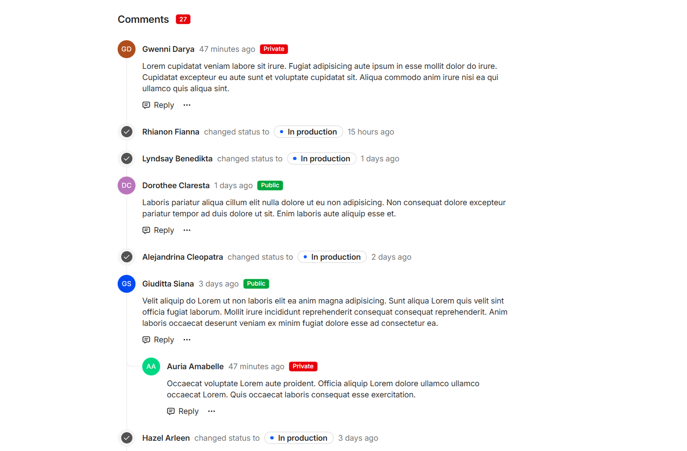

# Timeline

Timeline is an [Angular](https://angular.io/) component designed to demonstrate how to display a timeline of events and notes.

## Features

- Display text notes
- Display events with tags

## Prerequisites

- [Node.js](https://nodejs.org/en/) (v20.x)
- [Angular](https://angular.io/) (v19.x)
- [Tailwind CSS](https://tailwindcss.com/) (v4.x)

## Demo

## License

Timeline is released under the MIT License. See the [LICENSE](LICENSE) file for more information.
